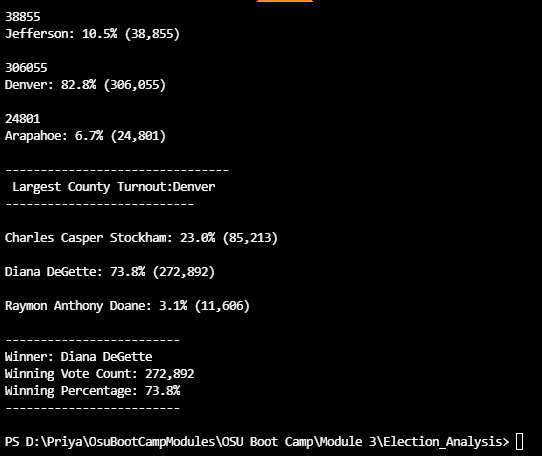

## Overview of Election Audit
### The purpose of this project is to assist a Colorado Board of Election employee Tom in an election audit of the tabulated results for US Congressional precinct.  By the end of the project we will help Tom to find out the total number of votes casted, the total number of votes for each candidate, the percentage of votes, and the winner of the election. We automate the process with the help of Python as a programming language.
### Please find the attached data file used for this project
  [election_results.csv](Resources/election_results.csv)
##  Election Audit Results
-	There are total number of 369,711 votes were casted in this election
-	Please find the report of votes casted by counties.
o	Jefferson: 38,855 votes (10.5%)
o	Denver:    306,055(82.8%)
o	Arapahoe: (24,801) (6.7%)
-	Based on the results above Denver reported the highest vote count.
-	Please find the breakdown for votes received by each candidate.
o	Charles Casper Stock ham: 23.0% (vote #: 85,213)
o	Diana DeGette: 73.8% (vote #272,892)
o	Raymon Anthony Doane: 3.1%(vote#11,606)
-	From the final report, the winner was announced as Diana DeGette who won 272,892 votes which 73.8% of total votes.
-	###please find the report as below:

## Election-Audit Summary
 ### This script can be modified to include additional data points like state wise or nationwide information and produce similar analysis, which can help other departments to automate their process for declaring election results.
            
